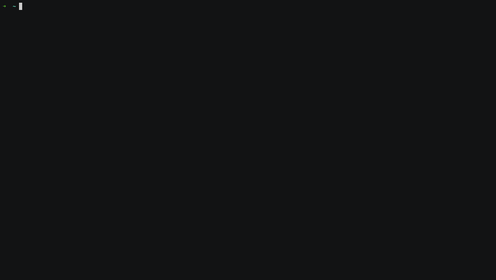
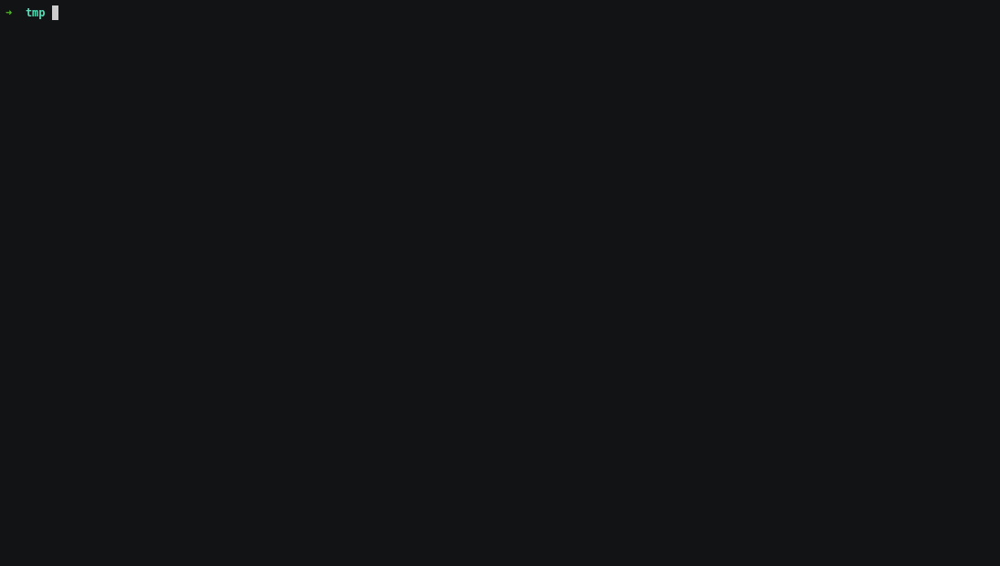

# Project "Page Loader"


[](https://codeclimate.com/github/deputatov/backend-project-lvl3/maintainability)
[](https://codeclimate.com/github/deputatov/backend-project-lvl3/test_coverage)

Project [backend-project-lvl3](https://ru.hexlet.io/professions/backend/projects/4)

Mentor [Roman Pushkov](https://ru.hexlet.io/u/aenglisc)

## Setup

```
$ make install
```

## Run test

```
$ make test
```

## Install

```
$ sudo npm link
```

## Usage

### CLI

```
$ page-loader /tmp/ https://lodash.com
```

<p align="center">  </p>

### Debug
```
$ DEBUG=page-loader,axios page-loader https://lodash.com
```

<p align="center">  </p>

### Errors

<p align="center">  </p>